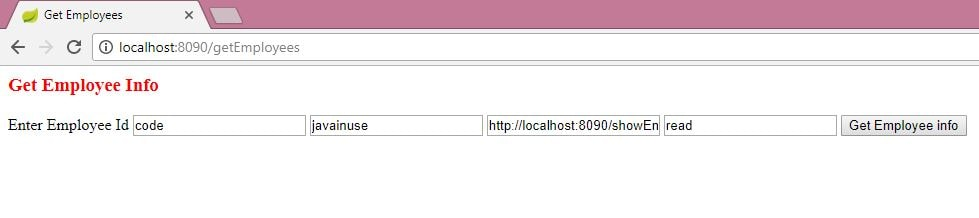
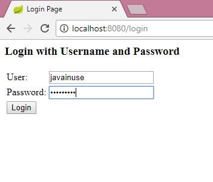
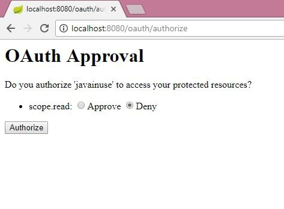
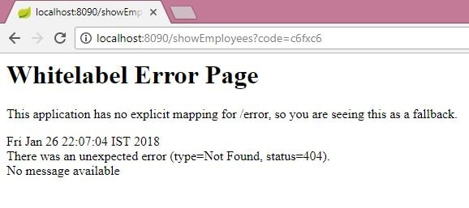

# Spring Boot OAuth2 - Authorization

## Resource Server Application

* Create a maven project which will authenticate and return json data. Also we will be configuring the authorization server.

* Define the Spring Boot bootstrap class having the SpringBootApplication annotation.

* Define the model class Employee. We will be return this model class as JSON response.

* Define the controller that exposes a GET REST endpoint to return JSON as response.

* We will be configuring security. In this configuration we specify which urls are to be intercepted, and are to be accessed by which users and having which roles.

* We configure an authorization server using EnableAuthorizationServer annotation.

## Client Application

* We will create the client application. This application will ask the resource server we created above for JSON data. As explained previously we have assumed that this Client Application is already registered to the Resource Server, and has got the client id as 'javainuse' and secret key as 'secret'.

* Create the Controller class with the getEmployeeInfo method which returns a jsp page.

* Create a application.properties file
- spring.mvc.view.prefix:/WEB-INF/jsp/
- spring.mvc.view.suffix:.jsp
- server.port:8090

* At last create the Spring Boot Bootstrap class with SpringBootApplication annotation.

* Create the getEmployees.jsp using which we will POST a request to /authorize in form encoded url format.

### Run the Server and Client Application

* Run server `[SpringBootResourceServerApplication.java]`
* Run client `[SpringBootFormHandingApplication.java]`

### Look like attached image

